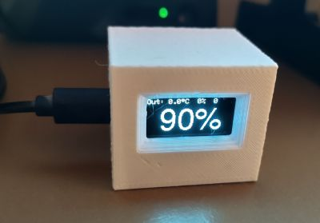
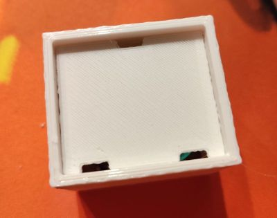
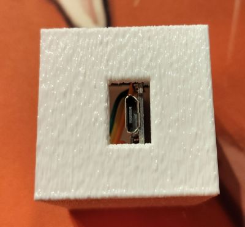
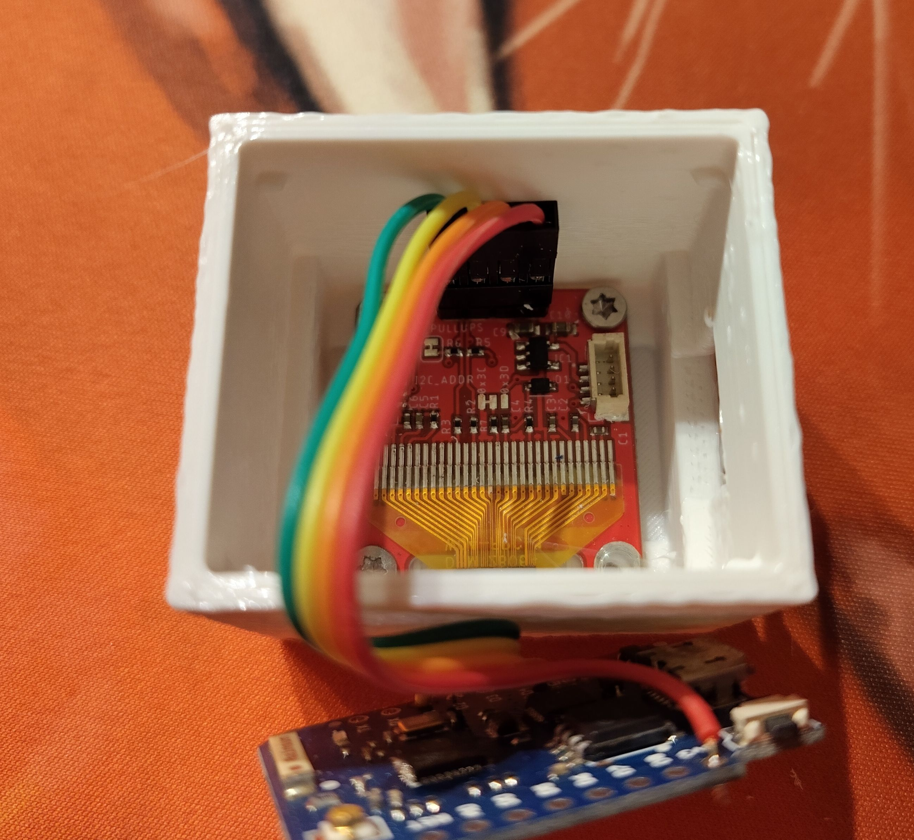
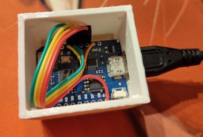

# box-oled128x64_096-esp8266
3D printable box for Wemos ESP8266 D1 mini and 128x64 0.96'' OLED display

This is a FreeCad 1.2 project of simple small box with display on the front.
Only additional items you need is 4x M2x4 screws for display fitting. Alternatively you can glue the display with hot glue.

Display:
  [LaskaKit OLED display 128x64 0.96 I²C](https://www.laskakit.cz/en/laskakit-oled-displej-128x64-0-96-i2c/)
Wemos:
  [WeMos D1 Mini Pro 16MB ESP8266 WiFi Module](https://www.laskakit.cz/en/wemos-d1-mini-pro--esp8266-wifi-modul/)
  
How-to:
1. Grab the stl files:
  body: oled128x64_096-esp8266-back-coverback-cover-pad-chamfer.stl
  back: oled128x64_096-esp8266-faceback-cover-blockers-pad.stl
2. Slice it.

Or you can use oled128x64_096-esp8266.3mf project for Prusa slicer.

## Photos

